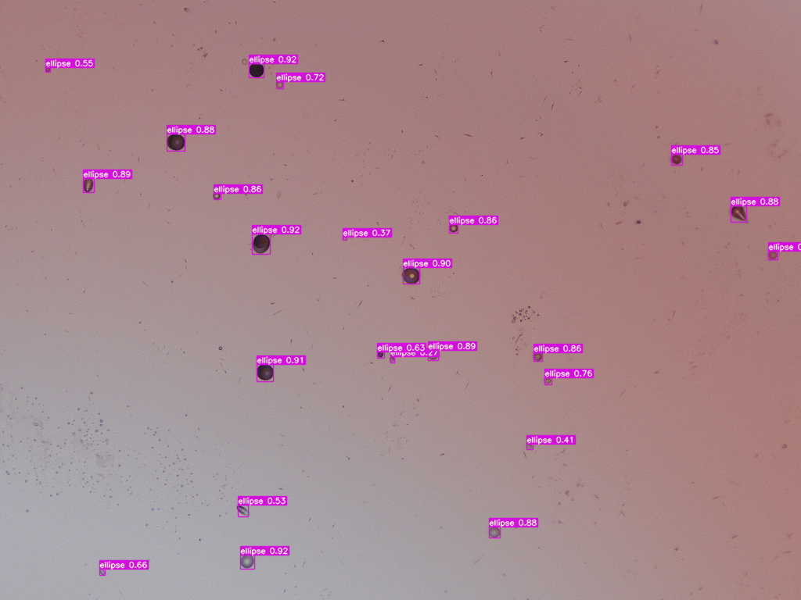
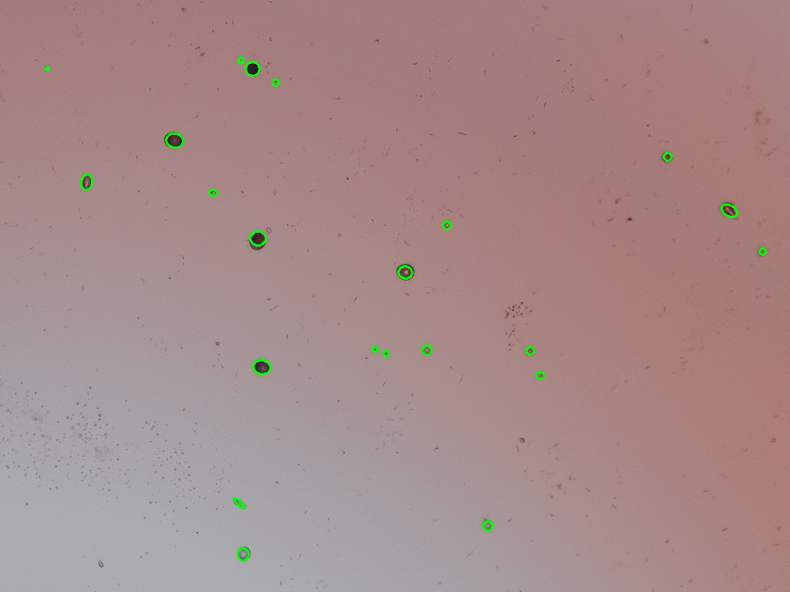

# TEDM:Two-stage Ellipse Detection based on Multi-granularity Feature and edge Feature Extraction


## Config

config/config.yaml is the global configuration file

```yaml
imagesDir: 'dataset/images' # 图片地址
labelsDir: 'dataset/labels' # json标记文件地址
dataPreDeal:
  outputXml: 'dataset/xmlData'  # 输出的xmlData地址
  outputTxt: 'dataset/txtData'  # 输出yolo格式文件地址
  trainRadio: 0.8  # 训练集分割比例， test分割比例为：(1- trainRadio)
  splitTxtPath: 'yolov7/dataset/lzjc' # 分割文件val.txt, train.txt地址, dataset下也会保存一份
detector:
  output: 'dataset/detector'
  imageDir: 'yolov7/inference/images'
  saveTxt: True
  device: '0' # 这里只能填’cpu\0\1\2..‘
  val: True
  weight: 'yolov7/runs/train/lzjc/weights/best.pt'
  valTxtPath: 'dataset/val.txt'
measurer:
  output: 'dataset/measurer' # 测量结构保存地址
  imageDir: 'measurer/data/images' # 测量的图片地址
  rectDir: 'measurer/data/rectLabel' # 一阶段detector生成的txt结果地址
  saveTxt: True  # 是否将结果保存
  device: 'cuda'
  val: True # 是否对测试集进行测量，用于查看模型在测试集上的效果
  weight: 'measurer/checkpoints/checkpoints_300.pth' # 权重文件
  valTxtPath: 'dataset/val.txt' # 测试集val.txt文件地址
```

Note: Always use "/" for paths, not "\", and preferably use relative paths.


## Installation

```powershell
conda create -n lzjc python=3.8
# 进入到项目根目录LZJC文件夹，运行下面命令切换conda环境
conda activate lzjc
# 安装对应库
pip install -r requirements.txt
```


## 数据预处理

This phase mainly designs the correction algorithm to correct the manual labeling content to reduce the error, and generates the required files for the model.
This can be done by modifying the corresponding parameters in dataPreDeal in the global configuration file config.yaml
Perform data preprocessing:
```cmd
python dataPreDeal/main.py
```


## Training

### the coarse-grained positioning stage

#### Training

```cmd
cd yolov7
python train.py --bach_size=2 --epochs=300
```
See train.py for specific configurations.


### the fine-grained measurement stage

#### Training

```cmd
cd measurer
python train.py --bach_size=2 --epochs=300
```

The final training results of the model are saved by default under measurer/checkpoints
See train.py for specific configurations.


## Testing

Switching to the root directory to execute the main.py method allows you to control the output path by configuring the global configuration file

```cmd
python main.py 
python main.py --val  --valTxtPath 'dataset/val.txt'
```

The results of the last two stages of detection are saved in the detector and measurer folders under dataset.

The detector folder is used to save the results of the first stage：

The results are saved in the label folder (category, relative centroid x, relative centroid y, relative rectangular box length w, relative rectangular box length h ), see yolo dataset file format for details.



The measurer folder is used to save the results of the second stage.：
The results are saved in the label folder (center point x, center point y, long axis length a, short axis length b, offset angle).




model comparison


